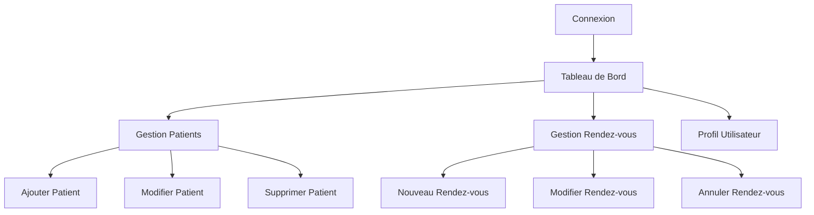

# 🏥 Système de Gestion de Clinique JavaFX

<div align="center">
  
  
  
  
  
  

  <h3>💼 Application complète de gestion de clinique médicale</h3>
  <p><em>Une solution moderne et intuitive pour la gestion des patients et des rendez-vous développée avec JavaFX et MySQL</em></p>
  
  <a href="#-fonctionnalités">Fonctionnalités</a> •
  <a href="#-installation">Installation</a> •
  <a href="#-utilisation">Utilisation</a> •
  <a href="#-architecture">Architecture</a> •
  <a href="#-contribution">Contribution</a>

</div>

---

## 📋 Vue d'ensemble

Ce projet est une **application desktop complète** développée dans le cadre d'un projet universitaire en Java. Elle permet de gérer efficacement les patients et leurs rendez-vous dans une clinique médicale avec une interface utilisateur moderne et intuitive.

### 🎯 Objectifs du Projet
- ✅ Créer une application complète avec interface graphique JavaFX
- ✅ Implémenter les opérations CRUD (Create, Read, Update, Delete)
- ✅ Établir une connexion sécurisée à une base de données MySQL
- ✅ Suivre l'architecture MVC (Modèle-Vue-Contrôleur)
- ✅ Sécuriser l'accès via un système d'authentification robuste

---

## ✨ Fonctionnalités

<table>
<tr>
<td width="50%">

### 🔐 **Authentification Sécurisée**
- Connexion avec email et mot de passe
- Création de comptes utilisateur
- Hachage des mots de passe (SHA-256)
- Gestion des sessions utilisateur
- Déconnexion sécurisée

### 👥 **Gestion des Patients**
- Ajout de nouveaux patients
- Modification des informations existantes
- Suppression avec confirmation
- Recherche avancée par nom/prénom
- Affichage des détails complets

</td>
<td width="50%">

### 📅 **Gestion des Rendez-vous**
- Planification de nouveaux rendez-vous
- Association automatique patient-rendez-vous
- Modification et annulation flexibles
- Vue calendaire des plannings
- Validation des conflits horaires

### 👤 **Profil Utilisateur**
- Consultation des informations personnelles
- Modification du mot de passe
- Historique des connexions
- Préférences utilisateur

</td>
</tr>
</table>

---

## 🛠️ Technologies Utilisées

<div align="center">

| **Frontend** | **Backend** | **Base de Données** | **Sécurité** |
|:---:|:---:|:---:|:---:|
|  |  |  |  |
| FXML + CSS | JDBC | Relationnelle | Hachage |

</div>

### 📚 Stack Technique Détaillée
```
Frontend:    JavaFX 21 + FXML + CSS
Backend:     Java 17+ + JDBC
Database:    MySQL 8.0
Security:    SHA-256 Hashing
Pattern:     MVC (Model-View-Controller)
Build Tool:  Maven (optionnel)
```

---


## 🚀 Installation

### 📋 Prérequis
```
☑️ Java JDK 11 ou supérieur
☑️ MySQL 5.7 ou supérieur  
☑️ JavaFX SDK (si pas inclus dans le JDK)
☑️ Git (pour cloner le projet)
```

### 🔧 Installation Étape par Étape

1. **📥 Cloner le Repository**
   ```bash
   git clone https://github.com/votre-username/clinique-javafx.git
   cd clinique-javafx
   ```

2. **🗄️ Configurer la Base de Données**
   ```sql
   -- Créer la base de données
   CREATE DATABASE clinique_db;
   
   -- Importer le schéma
   mysql -u root -p clinique_db < database/clinique_db.sql
   ```

3. **⚙️ Configuration de la Connexion**
   ```java
   // Dans utils/DatabaseConfig.java
   private static final String URL = "jdbc:mysql://localhost:3306/clinique_db";
   private static final String USERNAME = "votre_username";
   private static final String PASSWORD = "votre_password";
   ```

4. **▶️ Compiler et Exécuter**
   ```bash
   # Compilation
   javac -cp ".:lib/*" src/main/java/Main.java
   
   # Exécution
   java -cp ".:lib/*:src/main/java" Main
   ```

---

## 📖 Utilisation

### 🎯 Démarrage Rapide

1. **Créer un Compte**
   - Lancez l'application
   - Cliquez sur "Créer un compte"
   - Remplissez le formulaire d'inscription

2. **Se Connecter**
   - Entrez votre email et mot de passe
   - Cliquez sur "Se connecter"

3. **Naviguer dans l'Application**
   - Utilisez le menu latéral pour accéder aux fonctionnalités
   - Gérez les patients et rendez-vous selon vos besoins

### 🔄 Flux de Travail Typique



---
